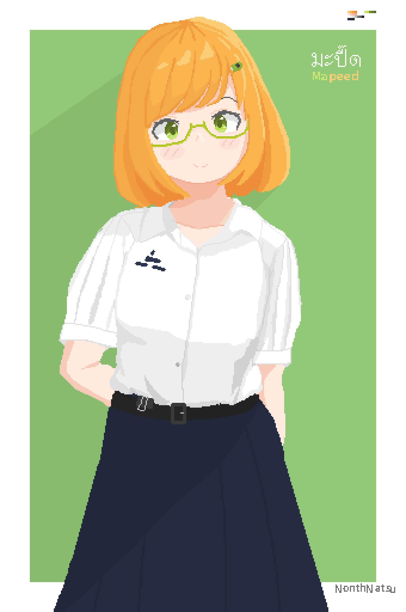
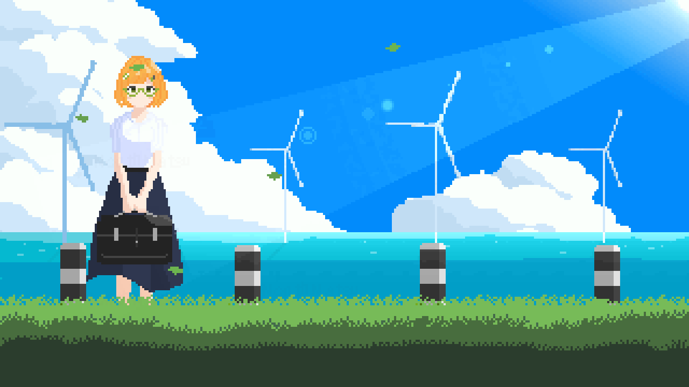

## Animation
:::tip
You can see more of my work at
- [Pixiv](https://www.pixiv.net/en/users/84081089)
- [X (twitter)](https://x.com/NonthaNatsu)
:::
## Seaside Road  (Yuru CampΔ Fan art)
<blockquote class="twitter-tweet" data-media-max-width="560">
Seaside Road (Yuru CampΔ Fan art)  Tools : Godot Engine + Aseprite <a href="https://t.co/xKa94CyH6p">pic.twitter.com/xKa94CyH6p</a>
&mdash; NonthNatsu (@NonthaNatsu) <a href="https://twitter.com/NonthaNatsu/status/1808784060472254674?ref_src=twsrc%5Etfw">July 4, 2024</a></blockquote> 

:::note
This Animation was featured in an article on "pixivision", a creative media site operated by pixiv.
- [( pixivision.net ) ピクセルが動き出す！ ドット絵のうごイラ特集](https://www.pixivision.net/ja/a/10544)
:::

## Return home in the evening
<blockquote class="twitter-tweet" data-media-max-width="560">
Return home in the evening <a href="https://twitter.com/hashtag/pixelartwork?src=hash&amp;ref_src=twsrc%5Etfw">#pixelartwork</a> <a href="https://twitter.com/hashtag/pixelart?src=hash&amp;ref_src=twsrc%5Etfw">#pixelart</a> <a href="https://t.co/jrt7oJwxr5">pic.twitter.com/jrt7oJwxr5</a>
&mdash; NonthNatsu (@NonthaNatsu) <a href="https://twitter.com/NonthaNatsu/status/1901140749317546141?ref_src=twsrc%5Etfw">March 16, 2025</a></blockquote> 

## Mapeed (My original character)

